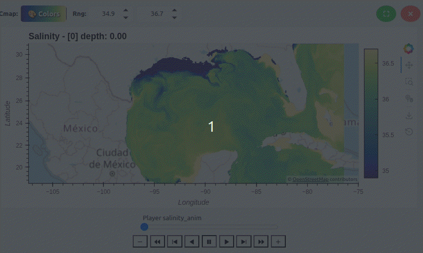

# 🌊 NcDashboard

[](https://github.com/olmozavala/ncdashboard)
[](https://www.python.org/)
[](#)

**NcDashboard** bridges the gap between legacy viewers (like NcView) and complex, code-heavy workflows (Xarray/Iris). It enables browser-based exploration of remote HPC datasets, providing a high-performance, reactive interface for atmospheric and oceanographic data.


---

## 🚀 Key Technical Contributions

*   **Web-Native Remote Access:** High-performance exploration of large-scale data directly on HPC clusters via a simple web interface.
*   **Linked Multi-Modal Views:** 1D to 4D visualizations (maps, profiles, time-series) through a recursive node-based tree model. Viewport zoom and position are synchronized across related plots.
*   **LLM-Driven Analysis:** Natural-language custom fields (e.g., "calculate vorticity") generated as containerized Python code and auto-integrated into the UI.
*   **Automatic Robust Scaling:** Uses percentile-based scaling (2% - 98%) to ensure visualizations look good immediately, even with extreme outliers.

## 📊 Comparison at a Glance

| Feature | NcView | Iris/Xarray | **NcDashboard** |
| :--- | :---: | :---: | :---: |
| Remote/HPC Workflow | Limited | Manual | **Native** |
| Interactive Pan/Zoom | Basic | Coding Req. | **Dynamic** |
| AI-Custom Analysis | No | No | **Built-in** |
| Session Sharing | No | Scripts | **JSON State** |

---

## 🛠️ Installation

This project uses `uv` for lightning-fast Python package and environment management.

### 1. Install `uv`
If you don't have `uv` installed, follow the instructions at [astral.sh/uv](https://astral.sh/uv).

### 2. Clone and Setup
```bash
git clone https://github.com/olmozavala/ncdashboard.git
cd ncdashboard
uv sync
```
This will automatically create a `.venv` directory and install all required dependencies as defined in `pyproject.toml`.

---

## 🏃 Running

To run the dashboard, provide the path to the NetCDF file or directory using `uv run`:

```bash
# Single file
uv run ncdashboard.py test_data/gom_t007.nc

# Multiple files with regex
uv run ncdashboard.py test_data --regex "*.nc"

# Specify a custom port
uv run ncdashboard.py path --port 8055
```

---

## ✨ Key Functionalities

### 1. Dynamic Navigation & Animations
Bulk load NetCDF files; variables are auto-mapped to 1D–4D visual nodes for one-click plotting. Navigate through time and depth dimensions seamlessly with synchronized sliders.



### 2. 🤖 AI-Powered Custom Analysis
Compute derived fields (e.g., *vorticity*, *velocity*, *mean temperature*) via LLM prompts. The AI generates isolated Python code, executes it, and inserts results directly as new interactive figures.


### 3. Reproducibility (Portable Workspaces)
Save/load your full workspace—including active plots, zoom levels, selected indices, colormaps, and even AI-generated code—to a single JSON file.


---

## 🏗️ Architecture

Built on a modern Python stack (**Panel, Xarray, Datashader**), the NcDashboard architecture prioritizes performance and scalability by utilizing a recursive tree-based model. 


*   **Recursive FigureNodes:** A tree-based model where nodes (1D–4D) inherit data context and handle dynamic rendering updates.
*   **Lazy Evaluation:** Data is streamed via **Dask/Xarray** and rendered on-demand, allowing large-scale exploration without memory overflow.
*   **AI Execution Sandbox:** LLM-generated code runs in an isolated environment with restricted imports and restricted memory.

---

## 🗺️ Roadmap

Our next milestone is the integration of **vector GIS layers** (Points, Lines, Polygons; e.g., Shapefile/GeoJSON). This will enable:
*   **Advanced Spatial Analytics:** Perform shape-based operations such as calculating scientific quantities along transects (lines).
*   **Regional Focus:** Crop variables within complex polygons (states, EEZs, etc.).
*   **In-Situ Comparison:** Automated value extraction at station locations (points).

---

## 🔗 Links

- [Official Documentation](USER_GUID.md)
- [Developer Guide](DEVELOPER_GUIDE.md)
- [Panel Documentation](https://panel.holoviz.org/)
- [HoloViews Documentation](https://holoviews.org/)
- [GeoViews Documentation](https://geoviews.org/)